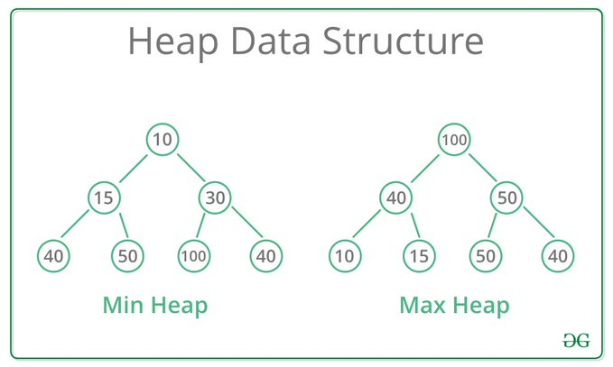
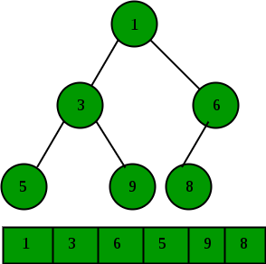
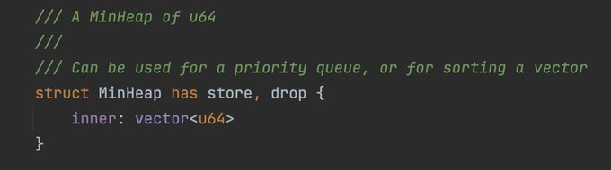
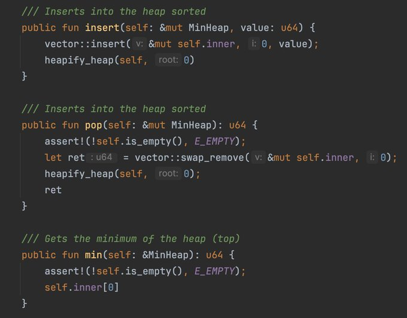
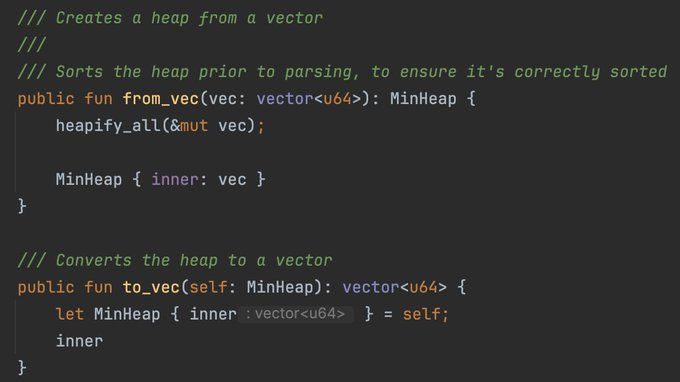
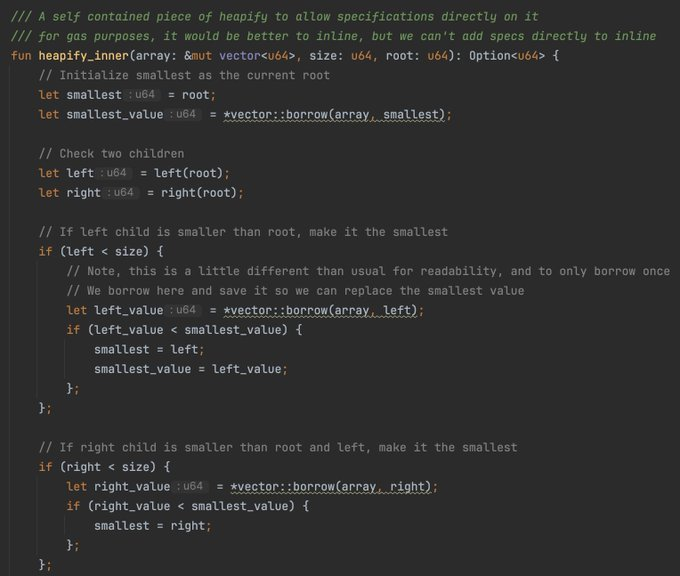
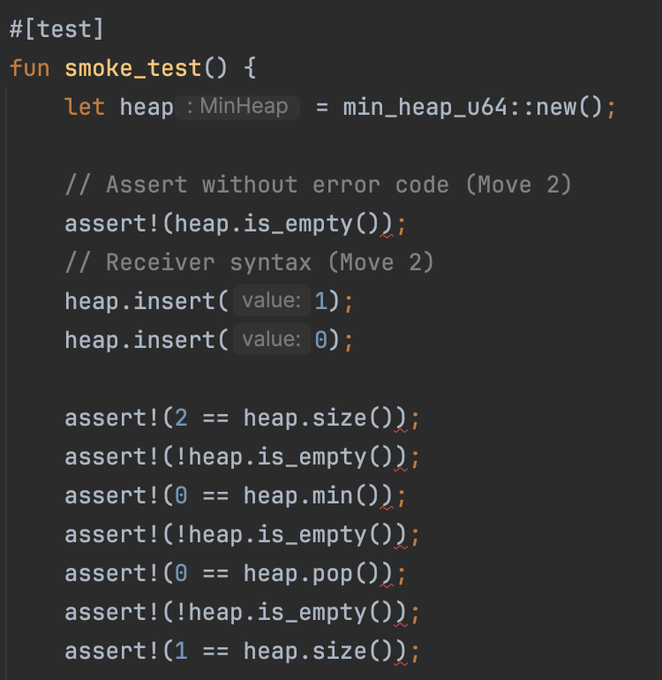
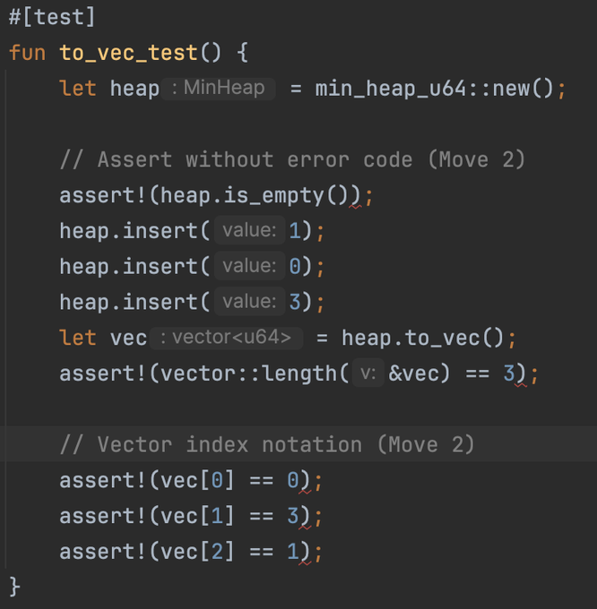

Wondering what 
@Aptos
 announced for Move 2 at Aptos Experience?  Let's dive into an example that takes advantage of a couple of the features of Move 2.

We'll explore it with a common data structure, the heap on the long delayed next episode of #DailyMove

#### 1 A heap is a common data structure used in software.  It's characterized by keeping track of the highest or lowest values.  In this case, we'll make a min heap (lowest value first).  It's often represented as a tree, where the found value is on top.

#### 2 However, it will be represented as an array representation of the tree, the left most value is the lowest value.  They would be in tree traversal order.  The below image shows how it maps between the two representations.

#### Now, let's dive into some Move code:

We can define the data structure as a struct, and the underlying data is the vector representation of the tree.

#### Next, we provide a bunch of functions to access the heap.  Note that each function has "self" as the first argument as both "&mut MinHeap" or "&MinHeap".

#### In Move 2, receiver style syntax (e.g. heap.pop()) can be used if the variable is named self.

#### This also applies to functions that consume "self".  Note that the variable names have to match the spec as well.

Finally, a heapify function that maintains that the heap is order.

Now, to showoff some of the features of Move 2 in a unit test.  

Here we can see a couple features:
1. Receiver style functions heap.insert() and heap.isEmpty().  This makes it much more like an object-oriented programming language.
2. assert! without an error code.  This makes it much simpler for unit tests, where you might not care what the error is.

#### Additionally, a much requested ask, is the index notation on a vector, so now you can easily retrieve values in a vector with brackets.

To enable Move 2, you can add --compiler-version v2 and --language-version 2.0 to any aptos move cli command.
